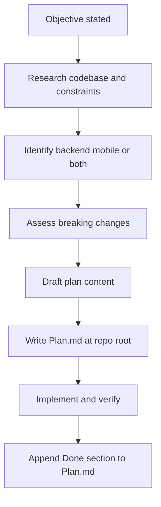

# Autonomous plan and implement

Run a **planning phase** as rigorous as Cursor Plan mode (research → decisions → concrete steps), **persist it in `Plan.md`**, then **implement**. Do not ask the user to confirm normal tradeoffs; record assumptions and proceed.

Stack context: follow [`.cursor/rules/core-planning.mdc`](../../rules/core-planning.mdc) (backend, mobile, GraphQL/codegen, DAO/service patterns, `pnpm`).

## When to use

- User states an objective and wants a written plan **and** code changes.
- Phrases like “plan and build”, “implement this end to end”, “don’t ask me unless blocked”.
- Multi-step or cross-cutting work (API + mobile, schema + clients).

## Workflow

## `Plan.md` (required before substantive edits)

**Path:** repository root `Plan.md` (same directory as `package.json` / workspace root for this repo).

**If `Plan.md` already exists:** overwrite when this run fully supersedes the prior work; otherwise append a dated `## …` section or move the old file once to `Plan.archive-<short-slug>.md`.

**Required sections** (headings may vary; content must be present):

| Section                      | Content                                                                      |
| ---------------------------- | ---------------------------------------------------------------------------- |
| Objective                    | Goal and definition of done                                                  |
| Scope                        | backend / mobile / both; out of scope                                        |
| Breaking changes & migration | GraphQL, Prisma/DB, clients, versioning; or explicit “none”                  |
| Assumptions                  | Defaults chosen without asking the user                                      |
| Implementation plan          | Ordered steps with **concrete file paths**                                   |
| Verification                 | Commands (`pnpm lint` in `backend` / `mobile`, tests, codegen if applicable) |

While drafting, explicitly scan: GraphQL schema, Prisma/migrations, response shapes, mobile codegen, feature flags, env vars. Prefer order: schema → migration → backend resolvers/services → mobile operations → UI.

**After implementation:** append a `## Done` section to the same `Plan.md` (what shipped, key files touched). **Default:** commit `Plan.md` with the change set for review unless the project has agreed to ignore it.

## When to ask the user (only if blocked)

Ask or stop **only** for: missing secrets/credentials, irreversible data loss, ambiguous destructive scope, or legal/compliance ambiguity. Do **not** ask for naming, style, or ordinary product tradeoffs—state the choice under **Assumptions**.

## Execution

1. Complete **write `Plan.md`** first (no feature code before that, except read-only exploration).
2. Implement in small, reviewable steps; match existing patterns (DAO/service on backend; `@/` and generated GraphQL types on mobile).
3. Run linters after edits (`pnpm lint:fix` in the affected app directories per workspace rules).
4. Update `Plan.md` **Done** section and give a short chat summary.

## Pull request

If the user asks to open a PR for this work, follow [`.cursor/skills/create-pr/SKILL.md`](../create-pr/SKILL.md). That skill **excludes `Plan.md` from PR title and Summary bullets** (so the headline reflects code changes) and **embeds `Plan.md` in the PR body** under `## Plan` when the file exists.

## Note on “Plan mode”

Cursor Plan mode is a UI mode this skill cannot toggle. The agent still performs the same **discipline**: research, scope, breaking-change analysis, file-level plan on disk, then execute.
